UNIVERSIDADE FEDERAL DO RIO GRANDE DO SUL INSTITUTO DE INFORM TICA 

DISCIPLINA: SISTEMAS DIGITAIS 

Prof. Fernanda Lima Kastensmidt 

2022-2 

Trabalho 1   Sistemas Digitais   Individual          Aluno: Pedro Henrique Casarotto Rigon (00325358) 

Projeto do Processador Ahmes em VHDL 

Descri ªo do Ahmes: 

Este  relat rio  tem  como  objetivo  fornecer  uma  descri ªo  detalhada  da implementa ªo do Processador Ahmes que Ø descrito na linguagem de descri ªo 

de hardware VHDL (VHSIC Hardware Description Language) e consiste em trŒs componentes principais: 

`   `A mem ria: Ø descrita como um componente genØrico que Ø utilizado 

para armazenar dados. Ele possui portas de entrada e sa da para a leitura e escrita de dados, respectivamente. 

`   `O datapath: descreve a estrutura de dados da CPU e inclui todas as 

opera ıes que sªo executadas pelo CPU. Ele inclui as portas para controlar as opera ıes que sªo executadas e a troca de dados.  

`   `A unidade de controle: descreve a l gica de controle da CPU e inclui 

todas as decisıes sobre as opera ıes que devem ser executadas. 

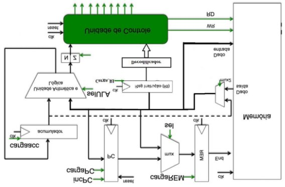

Descri ªo do Datapath: 

O datapath Ø o caminho de dados do processador e Ø composto por vÆrios componentes, incluindo registradores, unidades de controle e multiplexadores, que trabalham juntos para realizar as opera ıes de processamento. O datapath do processador Ahmes Ø composto por: 

`   `Registrador acumulador: Armazena o resultado de opera ıes da ULA. 

`   `Registrador  de  programa  contador:  Armazena  o  endere o  da  pr xima 

instru ªo a ser executada. 

`   `Registrador de instru ªo: Armazena a instru ªo atual. 

`   `Registrador de Flags: Armazena as flags geradas pela ULA. 

`   `Registrador de endere o remoto: Armazena o endere o de mem ria remoto. 

`   `Unidade l gico-aritmØtica (ULA): Realiza as opera ıes aritmØticas e l gicas.    Multiplexador 1: Seleciona a entrada para a mem ria. 

`   `Multiplexador 2: Seleciona a entrada para a ULA, Reg\_RI e Reg\_REM. 

Processamento: 

O processamento no datapath do processador Ahmes Ø controlado por sinais de entrada e por seus registradores internos. 

`   `Carga\_acumulador:  Se  este  sinal  estiver  ativo,  a  sa da  da  ULA  serÆ 

armazenada no registrador acumulador. 

`   `Inc\_PC:  Se  este  sinal  estiver  ativo,  o  contador  de  programa  serÆ 

incrementado em um. 

`   `Carga\_PC:  Se  este  sinal  estiver  ativo,  o  contador  de  programa  serÆ 

carregado com a entrada de endere o. 

`   `Reset: Se este sinal estiver ativo, todos os registradores serªo reiniciados. 

`   `Carga\_rem: Se este sinal estiver ativo, o registrador de endere o remoto serÆ 

carregado com a entrada de endere o. 

`   `Sel\_mux: Seleciona a entrada para o multiplexador 1. 

`   `Sel\_mux2: Seleciona a entrada para o multiplexador 2. 

`   `Carga\_RI:  Se  este  sinal  estiver  ativo,  o  registrador  de  instru ªo  serÆ 

carregado com a entrada de dado. 

`   `Sel\_ULA: Seleciona a opera ªo a ser realizada pela ULA. 

Qual componente FPGA escolheste para a s ntese? Spartan3E Quantos registradores tem o datapath do RAMSES? 5 Quantas opera ıes diferentes tem a ULA? 10 

A Ærea do DATAPTH em # LUTs: 116 e #ffps: 37 

Descri ªo da Unidade de Controle: 

A  entidade  "unidade\_de\_controle"  Ø  definida  com  vÆrios  elementos  de entrada  e  sa da.  Os  elementos  de  entrada  incluem  o  clock,  o  reset,  vÆrias instru ıes,  flags  de  condi ıes, entre  outros. JÆ  os  portos  de  sa da  incluem informa ıes sobre a carga de flags, o selecionador da ULA, o selecionador do MUX2, a carga de ACC, o selecionador do MUX1, a incrementa ªo do PC, a carga 

do PC, a carga do REM, a escrita na mem ria e a instru ªo HLT.  

A  UC  Ø  implementada  como  uma  FSM  com  8  estados.  Cada  estado representa uma etapa do ciclo de clock da UC e Ø determinado pela combina ªo de entrada de instru ıes e flags de condi ıes. A constante Ø utilizada para definir o valor de sa da para o selecionador da ULA de acordo com a instru ªo de entrada. 

O processo principal da UC consiste em ler a entrada atual e decidir qual serÆ o pr ximo estado e as sa das. No estado inicial, S0, a UC aguarda a recep ªo do 

reset para inicializar. Em seguida, a UC entra em um estado determinado pelo tipo 

de instru ªo recebida e pela condi ªo das flags. 

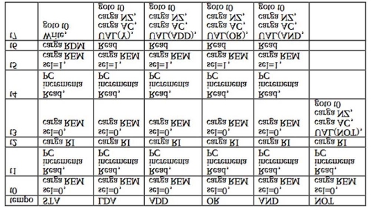

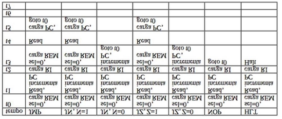

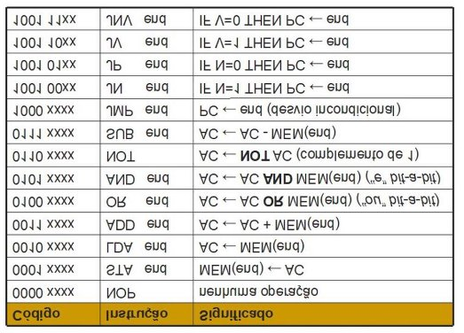

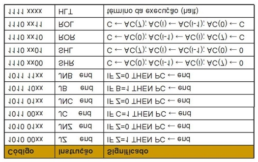

Completar a tabela a seguir com as instru ıes AHMES que nªo tem no NEANDER 

|Tempo |SHR |SHL |ROR |ROL |SUB |
| - | - | - | - | - | - |
|T0 |sel\_MUX1=0, Carga\_REM |sel\_MUX1=0, carga\_REM |sel\_MUX1=0, carga\_REM|sel\_MUX1=0, carga\_REM|sel\_MUX1=0, carga\_REM|
|T1 |Read, Inc\_PC |Read,  inc\_PC |Read,  inc\_PC|Read,  inc\_PC|Read,  inc\_PC|
|T2 |carga\_RI |carga\_RI |carga\_RI|carga\_RI|carga\_RI|
|T3 |ULA(SHR), carga\_ACC, carga\_FLAG, Goto t0 |ULA(SHR), carga\_ACC, carga\_FLAG, Goto t0 |ULA(SHR), carga\_ACC, carga\_FLAG, Goto t0|ULA(SHR), carga\_ACC, carga\_FLAG, Goto t0|sel\_MUX1=0, carga\_REM|
|T4 |||||Read, inc\_PC|
|T5 |||||sel\_MUX1=1, carga\_REM|
|T6 |||||Read|
|T7 |||||ULA(SUB), carga\_ACC, carga\_FLAG, Goto t0|
E as instru ıes novas de Desvio 

|Tempo |JP (N=0) |JP (N=1) |JV (V=1) |JV (V=0) |JNV (V=0) |JNV (V=1) |
| - | - | - | - | - | - | - |
|T0 |sel\_MUX1=0, Carga\_REM|sel\_MUX1=0, Carga\_REM|sel\_MUX1=0, Carga\_REM|sel\_MUX1=0, Carga\_REM|sel\_MUX1= 0, Carga\_REM|sel\_MUX1= 0, Carga\_REM|
|T1 |Read, Inc\_PC|Read, Inc\_PC|Read, Inc\_PC|Read, Inc\_PC|Read, Inc\_PC|Read, Inc\_PC|
|T2 |carga\_RI|carga\_RI|carga\_RI|carga\_RI|carga\_RI|carga\_RI|
|T3 |sel\_MUX1=0, carga\_REM|inc\_PC, goto t0|sel\_MUX1=0, carga\_REM|inc\_PC, goto t0|sel\_MUX1= 0, carga\_REM|inc\_PC, goto t0|
|T4 |Read ||Read||Read||
|T5 |carga\_PC, Goto t0||carga\_PC, Goto t0||carga\_PC, Goto t0||
|T6 |||||||
|T7 |||||||

|Tempo |JC (C=1) |JC (C=0) |JNC (C=0) |JNC (C=1) |JB (B=1) |JB (B=0) |
| - | - | - | - | - | - | - |
|T0 |sel\_MUX1=0, Carga\_REM|sel\_MUX1=0, Carga\_REM|sel\_MUX1=0, Carga\_REM|sel\_MUX1=0, Carga\_REM|sel\_MUX1= 0, Carga\_REM|sel\_MUX1= 0, Carga\_REM|
|T1 |Read, Inc\_PC|Read, Inc\_PC|Read, Inc\_PC|Read, Inc\_PC|Read, Inc\_PC|Read, Inc\_PC|
|T2 |carga\_RI|carga\_RI|carga\_RI|carga\_RI|carga\_RI|carga\_RI|
|T3 |sel\_MUX1=0, carga\_REM|inc\_PC, goto t0|sel\_MUX1=0, carga\_REM|inc\_PC, goto t0|sel\_MUX1= 0, carga\_REM|inc\_PC, goto t0|
|T4 |Read ||Read||Read||
|T5 |carga\_PC, Goto t0||carga\_PC, Goto t0||carga\_PC, Goto t0||
|T6 |||||||
|T7 |||||||

|Tempo |JNB (B=0) |JNB (B=1) |
| - | - | - |
|T0 |sel\_MUX1=0, Carga\_REM|sel\_MUX1=0, Carga\_REM|
|T1 |Read, Inc\_PC|Read, Inc\_PC|
|T2 |carga\_RI|carga\_RI|
|T3 |sel\_MUX1=0, carga\_REM|inc\_PC, goto t0|
|T4 |Read ||
|T5 |carga\_PC, Goto t0||
|T6 |||
|T7 |||
Descri ªo do Decodificador: 

O decodificador de instru ıes Ø responsÆvel por identificar a instru ªo a ser executada a partir da sa da do Registrador de Instru ªo (RI). Ele decodifica a sa da do RI, sinalizando com o valor 1 a flag da instru ªo correta. As entradas sªo a sa da do RI, enquanto as sa das sªo as flags de instru ıes, como NOP, STA, LDA, ADD, 

OR, AND, NOT, SUB, JMP, JN, JP, JV, JNV, JZ, JNZ, JC, JNC, JB, JNB, SHR, SHL, ROR, ROL e HLT.  

A l gica do decodificador Ø implementada com um processo que observa a sa da do RI. Todas as flags de instru ıes sªo inicializadas com o valor 0 e, em seguida, o processo verifica a sa da do RI para identificar a instru ªo correta. Se a 

sa da  do  RI  corresponder  a uma  das  op ıes  previamente  definidas,  a  flag  da instru ªo correspondente Ø sinalizada com o valor 1. 

Tabela de Instru ıes: 

|C di go em binÆrio |Instru  ªo |
| - | - |
|00000000 |NOP |
|00010000 |STA |
|00100000 |LDA |
|00110000 |ADD |
|01000000 |OR |
|01010000 |AND |
|01100000 |NOT |
|01110000 |SUB |
|10000000 |JMP |
|10010000 |JN |
|10010100 |JP |
|10011000 |JV |
|10011100 |JNV |
|10100000 |JZ |
|10100100 |JNZ |
|10101000 |JC |
|10101100 |JNC |
|10110000 |JB |
|10110100 |JNB |
|11000000 |SHR |
|11010000 |SHL |
|11100000 |ROR |
|11110000 |ROL |
|11111111 |HLT |

VHDL completo do Ahmes: 

library IEEE;

use IEEE.STD\_LOGIC\_1164. ALL;

use IEEE.NUMERIC\_STDA. LL;

entity ahmes is

Port ( clk : in STD\_LOGIC;

reset : in STD\_LOGIC;

flags : out STD\_LOGIC\_VECTOR( 4 downto 0); dout : out STD\_LOGIC\_VECTOR( 7 downto 0); hlt : out STD\_LOGIC);

end ahmes;

architecture Behavioral of ahmes is

COMPONENmTemoria

PORT(

clka : IN STD\_LOGIC;

wea : IN STD\_LOGIC\_VECTO(R0 DOWNTO0);

addra : IN STD\_LOGIC\_VECTO(R7 DOWNTO0);

dina : IN STD\_LOGIC\_VECTO(R7 DOWNTO0);

douta : OUTSTD\_LOGIC\_VECTO(R7 DOWNTO0) );

END COMPONE;NT

component datapath\_ahmes

Port ( clk : in STD\_LOGIC;

carga\_acc : in STD\_LOGIC;

inc\_pc : in STD\_LOGIC;

carga\_pc : in STD\_LOGIC;

reset : in STD\_LOGIC;

carga\_rem : in STD\_LOGIC;

sel\_mux : in STD\_LOGIC;

sel\_mux2 : in STD\_LOGIC;

carga\_ri : in STD\_LOGIC;

sel\_ula : in STD\_LOGIC\_VECTOR( 3 downto 0);

carga\_flag : in STD\_LOGIC;

endereco : out STD\_LOGIC\_VECTOR( 7 downto 0); dado\_entrada : out STD\_LOGIC\_VECTOR( 7 downto 0); dado\_saida : in STD\_LOGIC\_VECTOR( 7 downto 0);

reg\_ri : out STD\_LOGIC\_VECTO(R7 downto 0); flag\_ula\_control : out STD\_LOGIC\_VECTO(R4 downto 0));

end component ;

component unidade\_de\_controle

Port ( clk : in STD\_LOGIC;

reset : in STD\_LOGIC;

inst\_NOP : in STD\_LOGIC;

inst\_STA : in STD\_LOGIC;

inst\_LDA : in STD\_LOGIC;

inst\_ADD : in STD\_LOGIC;

inst\_OR : in STD\_LOGIC;

inst\_AND : in STD\_LOGIC;

inst\_NOT : in STD\_LOGIC;

inst\_SUB : in STD\_LOGIC;

inst\_JMP : in STD\_LOGIC;

inst\_JN : in STD\_LOGIC;

inst\_JP : in STD\_LOGIC;

inst\_JV : in STD\_LOGIC;

inst\_JNV : in STD\_LOGIC;

inst\_JZ : in STD\_LOGIC;

inst\_JNZ : in STD\_LOGIC;

inst\_JC : in STD\_LOGIC;

inst\_JNC : in STD\_LOGIC;

inst\_JB : in STD\_LOGIC;

inst\_JNB : in STD\_LOGIC;

inst\_SHR : in STD\_LOGIC;

inst\_SHL : in STD\_LOGIC;

inst\_ROR : in STD\_LOGIC;

inst\_ROL : in STD\_LOGIC;

inst\_HLT : in STD\_LOGIC;

flag\_N : in STD\_LOGIC;

flag\_Z : in STD\_LOGIC;

flag\_V : in STD\_LOGIC;

flag\_B : in STD\_LOGIC;

flag\_C : in STD\_LOGIC;

carga\_FLAG : out STD\_LOGIC;

carga\_RI : out STD\_LOGIC;

sel\_ULA : out STD\_LOGIC\_VECTOR( 3 downto 0); sel\_MUX2 : out STD\_LOGIC;

carga\_ACC : out STD\_LOGIC;

sel\_MUX1 : out STD\_LOGIC;

inc\_PC : out STD\_LOGIC;

carga\_PC : out STD\_LOGIC;

carga\_REM : out STD\_LOGIC;

hlt : out STD\_LOGIC;

write\_mem : out STD\_LOGIC);

end component ;

component decodificador\_inst

port (saida\_RI : in STD\_LOGIC\_VECTOR( 7 downto 0);

inst\_NOP : out STD\_LOGIC;

inst\_STA : out STD\_LOGIC;

inst\_LDA : out STD\_LOGIC;

inst\_ADD : out STD\_LOGIC;

inst\_OR : out STD\_LOGIC;

inst\_AND : out STD\_LOGIC;

inst\_NOT : out STD\_LOGIC;

inst\_SUB : out STD\_LOGIC;

inst\_JMP : out STD\_LOGIC;

inst\_JN : out STD\_LOGIC;

inst\_JP : out STD\_LOGIC;

inst\_JV : out STD\_LOGIC;

inst\_JNV : out STD\_LOGIC;

inst\_JZ : out STD\_LOGIC;

inst\_JNZ : out STD\_LOGIC;

inst\_JC : out STD\_LOGIC;

inst\_JNC : out STD\_LOGIC;

inst\_JB : out STD\_LOGIC;

inst\_JNB : out STD\_LOGIC;

inst\_SHR : out STD\_LOGIC;

inst\_SHL : out STD\_LOGIC;

inst\_ROR : out STD\_LOGIC;

inst\_ROL : out STD\_LOGIC;

inst\_HLT : out STD\_LOGIC);

end component ;

--signals

signal carga\_PC : std\_logic ; signal carga\_REM : std\_logic ; signal carga\_ACC : std\_logic ; signal carga\_FLAG : std\_logic ; signal carga\_RI : std\_logic ;

signal inst\_NOP : STD\_LOGIC; signal inst\_STA : STD\_LOGIC; signal inst\_LDA : STD\_LOGIC; signal inst\_ADD : STD\_LOGIC; signal inst\_OR : STD\_LOGIC; signal inst\_AND : STD\_LOGIC; signal inst\_NOT : STD\_LOGIC; signal inst\_SUB : STD\_LOGIC; signal inst\_JMP : STD\_LOGIC; signal inst\_JN : STD\_LOGIC; signal inst\_JP : STD\_LOGIC; signal inst\_JV : STD\_LOGIC; signal inst\_JNV : STD\_LOGIC; signal inst\_JZ : STD\_LOGIC; signal inst\_JNZ : STD\_LOGIC; signal inst\_JC : STD\_LOGIC; signal inst\_JNC : STD\_LOGIC; signal inst\_JB : STD\_LOGIC; signal inst\_JNB : STD\_LOGIC; signal inst\_SHR : STD\_LOGIC;

signal inst\_SHL : STD\_LOGIC; signal inst\_ROR : STD\_LOGIC;

signal inst\_ROL : STD\_LOGIC;

signal inst\_HLT : STD\_LOGIC;

signal inc\_PC : std\_logic ;

signal sel\_mux : std\_logic ;

signal sel\_mux2 : std\_logic ;

signal sel\_ULA : std\_logic\_vector ( 3 downto 0);

signal input\_MUX2 : STD\_LOGIC\_VECTOR( 7 downto 0); --vai endereco ou Ø da mem ria

signal dado\_entrada : STD\_LOGIC\_VECTOR( 7 downto 0); --vai endereco ou Ø da mem ria

signal output\_RI : STD\_LOGIC\_VECTO(R7 downto 0);

signal output\_REM : STD\_LOGIC\_VECTOR( 7 downto 0); --vai endereco ou Ø da mem ria

signal flag\_ula\_control : STD\_LOGIC\_VECTO(R4 downto 0);

signal iWrite : std\_logic\_vector ( 0 downto 0);

begin

datapapath: datapath\_ahmes

port map ( clk => clk,

carga\_acc => carga\_ACC, inc\_pc => inc\_PC, carga\_pc => carga\_PC, reset => reset,

carga\_rem => carga\_REM, sel\_mux => sel\_mux, sel\_mux2 => sel\_mux2,

carga\_ri => carga\_RI,

sel\_ula => sel\_ULA,

carga\_flag => carga\_FLAG,

endereco => output\_REM, dado\_entrada => dado\_entrada, dado\_saida => input\_MUX2,

reg\_ri => output\_RI,

flag\_ula\_control => flag\_ula\_control);

decod\_RI: decodificador\_inst

port map (saida\_RI => output\_RI,

inst\_NOP => inst\_NOP, inst\_STA => inst\_STA, inst\_LDA => inst\_LDA, inst\_ADD => inst\_ADD, inst\_OR => inst\_OR, inst\_AND => inst\_AND, inst\_NOT => inst\_NOT, inst\_SUB => inst\_SUB, inst\_JMP => inst\_JMP, inst\_JN => inst\_JN,

inst\_JP => inst\_JP,

inst\_JV => inst\_JV, inst\_JNV => inst\_JNV, inst\_JZ => inst\_JZ, inst\_JNZ => inst\_JNZ, inst\_JC => inst\_JC, inst\_JNC => inst\_JNC, inst\_JB => inst\_JB, inst\_JNB => inst\_JNB, inst\_SHR => inst\_SHR, inst\_SHL => inst\_SHL, inst\_ROR => inst\_ROR, inst\_ROL => inst\_ROL, inst\_HLT => inst\_HLT);

control\_unity: unidade\_de\_controle

port map ( clk => clk,

reset => reset,

inst\_NOP => inst\_NOP, inst\_STA => inst\_STA, inst\_LDA => inst\_LDA, inst\_ADD => inst\_ADD,

inst\_OR => inst\_OR, inst\_AND => inst\_AND,

inst\_NOT => inst\_NOT,

inst\_SUB => inst\_SUB,

inst\_JMP => inst\_JMP,

inst\_JN => inst\_JN,

inst\_JP => inst\_JP,

inst\_JV => inst\_JV,

inst\_JNV => inst\_JNV,

inst\_JZ => inst\_JZ,

inst\_JNZ => inst\_JNZ,

inst\_JC => inst\_JC,

inst\_JNC => inst\_JNC,

inst\_JB => inst\_JB,

inst\_JNB => inst\_JNB,

inst\_SHR => inst\_SHR,

inst\_SHL => inst\_SHL,

inst\_ROR => inst\_ROR,

inst\_ROL => inst\_ROL,

inst\_HLT => inst\_HLT,

flag\_N => flag\_ula\_control( 1), -- flag\_ula\_control (1) negativo flag\_Z => flag\_ula\_control( 0), -- flag\_ula\_control (0) zero flag\_V => flag\_ula\_control( 2), -- flag\_ula\_control (2) overflow flag\_B => flag\_ula\_control( 3), -- flag\_ula\_control (3) borrow flag\_C => flag\_ula\_control( 4), -- flag\_ula\_control (4) carry carga\_FLAG => carga\_FLAG,

carga\_RI => carga\_RI,

sel\_ULA => sel\_ULA,

sel\_MUX2 => sel\_mux2, carga\_ACC => carga\_ACC, sel\_MUX1 => sel\_mux, inc\_PC => inc\_PC, carga\_PC => carga\_PC, carga\_REM => carga\_REM, hlt => hlt,

write\_mem => iWrite( 0));

memory\_ahmes : memoria

PORT MAP(

clka => clk,

wea => iWrite,

addra => output\_REM,

dina => dado\_entrada,

douta => input\_MUX2 );

flags <= flag\_ula\_control; dout <= dado\_entrada;

end Behavioral ;

VHDL Completo do DataPath: 

library IEEE;

use IEEE.STD\_LOGIC\_1164. ALL;

use IEEE.NUMERIC\_STDA. LL;

entity datapath\_ahmes is

Port ( clk : in STD\_LOGIC;

carga\_acc : in STD\_LOGIC;

inc\_pc : in STD\_LOGIC;

carga\_pc : in STD\_LOGIC;

reset : in STD\_LOGIC;

carga\_rem : in STD\_LOGIC;

sel\_mux : in STD\_LOGIC;

sel\_mux2 : in STD\_LOGIC;

carga\_ri : in STD\_LOGIC;

sel\_ula : in STD\_LOGIC\_VECTOR( 3 downto 0);

carga\_flag : in STD\_LOGIC;

endereco : out STD\_LOGIC\_VECTOR( 7 downto 0); dado\_entrada : out STD\_LOGIC\_VECTOR( 7 downto 0); dado\_saida : in STD\_LOGIC\_VECTOR( 7 downto 0);

reg\_ri : out STD\_LOGIC\_VECTO(R7 downto 0); flag\_ula\_control : out STD\_LOGIC\_VECTO(R4 downto 0));

end datapath\_ahmes ;

architecture Behavioral of datapath\_ahmes is --Saida ULA Ø entrada do acumulador

signal ula\_output : std\_logic\_vector ( 7 downto 0);

--Saida do acumulador Ø entrada da ULA e do MUX2 signal acc\_output : std\_logic\_vector ( 7 downto 0);

--saida do MUX2 e entrada do RDM

signal mux2\_output : std\_logic\_vector ( 7 downto 0); --saida do MUX e entrada do RDM

signal mux\_output : std\_logic\_vector ( 7 downto 0);

--saida do RI e entrada do UC que Ø o reg\_ri

signal ri\_output : std\_logic\_vector ( 7 downto 0); --saida do PC e entrada do MUX

signal pc\_output : std\_logic\_vector ( 7 downto 0); --saida do rem depois passa para end

signal rem\_output : std\_logic\_vector ( 7 downto 0); --saida ULA controle flag

signal flag\_output : std\_logic\_vector ( 4 downto 0); --saida registrador flag

signal regflag\_output : std\_logic\_vector ( 4 downto 0);

begin

reg\_acumulador: process (clk, reset) begin

if reset = ’1’ then

acc\_output <= "00000000" ;        elsif clk ’event and clk= ’1’ then if carga\_acc = ’1’ then

acc\_output <= ula\_output;

else

acc\_output <= acc\_output;

end if ;

end if ;

end process ;

reg\_pc: process (clk, reset)

begin

if reset= ’1’ then

pc\_output <= "00000000" ;

elsif clk ’event and clk= ’1’ then

if carga\_pc = ’1’ then

pc\_output <= mux2\_output;

elsif inc\_pc = ’1’ then

pc\_output <= std\_logic\_vector ( unsigned (pc\_output) + 1); else

pc\_output <= pc\_output;

end if ;

end if ;

end process ;

reg\_instrucao: process (clk, reset)

begin

if reset= ’1’ then

ri\_output <= "00000000" ;

elsif clk ’event and clk= ’1’ then if carga\_ri = ’1’ then

ri\_output <= mux2\_output;

else

ri\_output <= ri\_output; end if ;

end if ;

end process ;

reg\_ri <= ri\_output;

--mux\_1:

mux\_output <= pc\_output when sel\_mux = ’0’ else

mux2\_output;

reg\_rem: process (clk, reset)

begin

if reset= ’1’ then

rem\_output <= "00000000" ; elsif clk ’event and clk= ’1’ then if carga\_rem = ’1’ then rem\_output <= mux\_output;

else

rem\_output <= rem\_output; end if ;

end if ;

end process ;

endereco <= rem\_output;

--mux\_2

mux2\_output <= acc\_output when sel\_mux2 = ’1’ else

dado\_saida;

dado\_entrada <= mux2\_output;

ula\_imp : process (mux2\_output, acc\_output, sel\_ula, flag\_output, ula\_output) variable ula\_operation : std\_logic\_vector ( 8 downto 0);

variable ula\_output\_var : std\_logic\_vector ( 7 downto 0);

begin

case sel\_ula is

when "0000" =>

ula\_operation := std\_logic\_vector ( signed ( ’0’ &acc\_output) + signed ( ’0’ &mux2\_output));

ula\_output\_var := ula\_operation( 7 downto 0);

flag\_output( 4) <= ula\_operation( 8);

flag\_output( 2) <= ula\_operation( 7) xor ula\_operation( 8); flag\_output( 3) <= ’0’ ;

when "0001" =>

ula\_operation := std\_logic\_vector ( signed ( ’0’ &acc\_output) - signed ( ’0’ &mux2\_output));

ula\_output\_var := ula\_operation( 7 downto 0);

flag\_output( 2) <= ula\_operation( 8);

flag\_output( 3) <= (ula\_operation( 7) xnor ula\_operation( 8)); flag\_output( 4) <= ’0’ ;

when "0010" =>

ula\_output\_var := (mux2\_output OR acc\_output); flag\_output( 3) <= ’0’ ;

flag\_output( 4) <= ’0’ ;

flag\_output( 2) <= ’0’ ;

ula\_operation := "000000000" ;

when "0011" =>

ula\_output\_var := (mux2\_output ANDacc\_output); flag\_output( 3) <= ’0’ ;

flag\_output( 4) <= ’0’ ;

flag\_output( 2) <= ’0’ ;

ula\_operation := "000000000" ;

when "0100" =>

ula\_output\_var := ( NOTacc\_output);

flag\_output( 3) <= ’0’ ;

flag\_output( 4) <= ’0’ ;

flag\_output( 2) <= ’0’ ;

ula\_operation := "000000000" ;

when "0101" =>

ula\_output\_var( 7 downto 1) := acc\_output( 6 downto 0); --SHL ula\_output\_var( 0) := ’0’ ;

flag\_output( 4) <= acc\_output( 7);

flag\_output( 3) <= ’0’ ;

flag\_output( 2) <= ’0’ ;

ula\_operation := "000000000" ;

when "0110" =>

ula\_output\_var( 6 downto 0) := acc\_output( 7 downto 1); ula\_output\_var( 7) := ’0’ ; --SHR

flag\_output( 4) <= acc\_output( 0);

flag\_output( 3) <= ’0’ ;

flag\_output( 2) <= ’0’ ;

ula\_operation := "000000000" ;

when "0111" =>

--ROR

ula\_output\_var( 7) := acc\_output( 0);

ula\_output\_var( 6 downto 0) := acc\_output( 7 downto 1); flag\_output( 4) <= acc\_output( 0);

flag\_output( 3) <= ’0’ ;

flag\_output( 2) <= ’0’ ;

ula\_operation := "000000000" ;

when "1001" =>

--y

ula\_output\_var := mux2\_output; flag\_output( 4) <= ’0’ ; flag\_output( 3) <= ’0’ ; flag\_output( 2) <= ’0’ ; ula\_operation := "000000000" ;

when "1111" =>

-- ROL

ula\_operation( 0) := acc\_output( 7);

ula\_operation( 7 downto 1) := acc\_output( 6 downto 0); ula\_output\_var := ula\_operation( 7 downto 0); flag\_output( 4) <= acc\_output( 7);

flag\_output( 3) <= ’0’ ;

flag\_output( 2) <= ’0’ ;

ula\_operation( 8) := ’0’ ;

when others =>

ula\_operation := "000000000" ; ula\_output\_var := "00000000" ; flag\_output <= "00000" ;

end case ;

if (ula\_output( 7) = ’1’ ) then

flag\_output( 1) <= ’1’ ; --flag do negativo else

flag\_output( 1) <= ’0’ ;

end if ;

if (ula\_output = "00000000" ) then

flag\_output( 0) <= ’1’ ; --flag do zero else

flag\_output( 0) <= ’0’ ;

end if ;

ula\_output <= ula\_output\_var; end process ;

reg\_flag: process (clk)

begin

if clk ’event and clk= ’1’ then

if carga\_flag = ’1’ then

regflag\_output <= flag\_output; else

regflag\_output <= regflag\_output; end if ;

else

regflag\_output <= regflag\_output; end if ;

end process ;

flag\_ula\_control <= regflag\_output;

end Behavioral ;

VHDL da Unidade de Controle Completo: 

library IEEE;

use IEEE.STD\_LOGIC\_1164. ALL;

entity unidade\_de\_controle is

Port ( clk : in STD\_LOGIC;

reset : in STD\_LOGIC; inst\_NOP : in STD\_LOGIC; inst\_STA : in STD\_LOGIC; inst\_LDA : in STD\_LOGIC; inst\_ADD : in STD\_LOGIC; inst\_OR : in STD\_LOGIC; inst\_AND : in STD\_LOGIC; inst\_NOT : in STD\_LOGIC; inst\_SUB : in STD\_LOGIC; inst\_JMP : in STD\_LOGIC; inst\_JN : in STD\_LOGIC; inst\_JP : in STD\_LOGIC;

inst\_JV : in STD\_LOGIC;

inst\_JNV : in STD\_LOGIC;

inst\_JZ : in STD\_LOGIC;

inst\_JNZ : in STD\_LOGIC;

inst\_JC : in STD\_LOGIC;

inst\_JNC : in STD\_LOGIC;

inst\_JB : in STD\_LOGIC;

inst\_JNB : in STD\_LOGIC;

inst\_SHR : in STD\_LOGIC;

inst\_SHL : in STD\_LOGIC;

inst\_ROR : in STD\_LOGIC;

inst\_ROL : in STD\_LOGIC;

inst\_HLT : in STD\_LOGIC;

flag\_N : in STD\_LOGIC;

flag\_Z : in STD\_LOGIC;

flag\_V : in STD\_LOGIC;

flag\_B : in STD\_LOGIC;

flag\_C : in STD\_LOGIC;

carga\_FLAG : out STD\_LOGIC;

carga\_RI : out STD\_LOGIC;

sel\_ULA : out STD\_LOGIC\_VECTOR( 3 downto 0); sel\_MUX2 : out STD\_LOGIC;

carga\_ACC : out STD\_LOGIC;

sel\_MUX1 : out STD\_LOGIC;

inc\_PC : out STD\_LOGIC;

carga\_PC : out STD\_LOGIC;

carga\_REM : out STD\_LOGIC;

hlt : out STD\_LOGIC;

write\_mem : out STD\_LOGIC);

end unidade\_de\_controle ;

architecture Behavioral of unidade\_de\_controle is

type tipoestado is (S0, S1, S2, S3, S4 , S5, S6, S7); signal estado, prox\_estado : tipoestado;

constant ADD\_inst : STD\_LOGIC\_VECTO(R3 downto 0) := "0000" ; constant SUB\_inst : STD\_LOGIC\_VECTO(R3 downto 0) := "0001" ;

constant OR\_inst : STD\_LOGIC\_VECTO(R3 downto 0) := "0010" ; constant AND\_inst : STD\_LOGIC\_VECTO(R3 downto 0) := "0011" ; constant NOT\_inst : STD\_LOGIC\_VECTO(R3 downto 0) := "0100" ; constant SHL\_inst : STD\_LOGIC\_VECTO(R3 downto 0) := "0101" ;

constant SHR\_inst : STD\_LOGIC\_VECTO(R3 downto 0) := "0110" ; constant ROR\_inst : STD\_LOGIC\_VECTO(R3 downto 0) := "0111" ;

constant ROL\_inst : STD\_LOGIC\_VECTO(R3 downto 0) := "1111" ;

constant Y\_inst : STD\_LOGIC\_VECTO(R3 downto 0) := "1001" ; begin

process (clk, reset)

begin

if reset = ’1’ then

estado <= s0;

elsif rising\_edge (clk) then

estado <= prox\_estado;

else

estado <= estado;

end if ;

end process ;

process (estado, inst\_NOP, inst\_STA, inst\_LDA, inst\_ADD, inst\_OR, inst\_AND, inst\_NOT, inst\_SUB, inst\_JMP, inst\_JN, inst\_JP, inst\_JV, inst\_JNV, inst\_JZ, inst\_JNZ,

inst\_JC, inst\_JNC, inst\_JB, inst\_JNB, inst\_SHR, inst\_SHL, inst\_ROR,

inst\_ROL, inst\_HLT,

flag\_N, flag\_Z, flag\_B, flag\_C, flag\_V)

begin

--declarar aqui prox\_estado <= S0; hlt <= ’0’ ; carga\_FLAG <= ’0’ ; carga\_RI <= ’0’ ; sel\_ULA <= "0000" ; sel\_MUX2 <= ’0’ ; carga\_ACC <= ’0’ ; sel\_MUX1 <= ’0’ ; inc\_PC <= ’0’ ; carga\_PC <= ’0’ ; carga\_REM <= ’0’ ; write\_mem <= ’0’ ;

Case estado is when S0 => sel\_MUX1 <= ’0’ ;

carga\_REM <= ’1’ ; prox\_estado <= S1;

when S1 =>

inc\_PC <= ’1’ ; prox\_estado <= S2;

when S2 =>

carga\_RI <= ’1’ ; prox\_estado <= S3;

when S3 =>

if (inst\_NOT = ’1’ ) then

sel\_ULA <= NOT\_inst; carga\_ACC <= ’1’ ; carga\_FLAG <= ’1’ ; prox\_estado <= S0;

elsif (inst\_JN = ’1’ ) then if flag\_N = ’0’ then       inc\_PC <= ’1’ ;

prox\_estado <= S0;

else

sel\_MUX1 <= ’0’ ;

carga\_REM <= ’1’ ;

prox\_estado <= S4; end if ;

elsif (inst\_JZ = ’1’ ) then if flag\_Z = ’0’ then       inc\_PC <= ’1’ ;

prox\_estado <= S0;

else

sel\_MUX1 <= ’0’ ;

carga\_REM <= ’1’ ;

prox\_estado <= S4; end if ;

elsif (inst\_NOP = ’1’ ) then

prox\_estado <= S0;

elsif (inst\_HLT = ’1’ ) then

hlt <= ’1’ ; inc\_PC <= ’0’ ; prox\_estado <= S3;

elsif (inst\_SHR = ’1’ ) then

sel\_ULA <= SHR\_inst; carga\_ACC <= ’1’ ; carga\_FLAG <= ’1’ ; prox\_estado <= S0;

elsif (inst\_SHL = ’1’ ) then

sel\_ULA <= SHL\_inst; carga\_ACC <= ’1’ ; carga\_FLAG <= ’1’ ; prox\_estado <= S0;

elsif (inst\_ROR = ’1’ ) then

sel\_ULA <= ROR\_inst; carga\_ACC <= ’1’ ; carga\_FLAG <= ’1’ ; prox\_estado <= S0;

elsif (inst\_ROL = ’1’ ) then

sel\_ULA <= ROL\_inst; carga\_ACC <= ’1’ ; carga\_FLAG <= ’1’ ; prox\_estado <= S0;

elsif (inst\_JP = ’1’ ) then if flag\_N = ’1’ then       inc\_PC <= ’1’ ;

prox\_estado <= S0;

else

sel\_MUX1 <= ’0’ ;

carga\_REM <= ’1’ ;

prox\_estado <= S4; end if ;

elsif (inst\_JV = ’1’ ) then if flag\_V = ’0’ then       inc\_PC <= ’1’ ;

prox\_estado <= S0;

else

sel\_MUX1 <= ’0’ ; carga\_REM <= ’1’ ;

prox\_estado <= S4; end if ;

elsif (inst\_JNV = ’1’ ) then if flag\_V = ’1’ then

inc\_PC <= ’1’ ; prox\_estado <= S0;

else

sel\_MUX1 <= ’0’ ;

carga\_REM <= ’1’ ;

prox\_estado <= S4; end if ;

elsif (inst\_JC = ’1’ ) then if flag\_C = ’0’ then       inc\_PC <= ’1’ ;

prox\_estado <= S0;

else

sel\_MUX1 <= ’1’ ; --- carga\_REM <= ’1’ ; prox\_estado <= S4;

end if ;

elsif (inst\_JNC = ’1’ ) then if flag\_C = ’1’ then

inc\_PC <= ’1’ ; prox\_estado <= S0;

else

sel\_MUX1 <= ’0’ ;

carga\_REM <= ’1’ ;

prox\_estado <= S4; end if ;

elsif (inst\_JB = ’1’ ) then if flag\_B = ’0’ then       inc\_PC <= ’1’ ;

prox\_estado <= S0;

else

sel\_MUX1 <= ’0’ ;

carga\_REM <= ’1’ ;

prox\_estado <= S4; end if ;

elsif (inst\_JNB = ’1’ ) then

if flag\_B = ’1’ then

inc\_PC <= ’1’ ; prox\_estado <= S0;

else

sel\_MUX1 <= ’0’ ;

carga\_REM <= ’1’ ;

prox\_estado <= S4; end if ;

elsif (inst\_JNZ = ’1’ ) then if flag\_Z = ’1’ then

inc\_PC <= ’1’ ; prox\_estado <= S0;

else

sel\_MUX1 <= ’0’ ;

carga\_REM <= ’1’ ;

prox\_estado <= S4; end if ;

else

sel\_MUX1 <= ’0’ ;

carga\_REM <= ’1’ ;

prox\_estado <= S4; end if ;

when S4 =>

if (inst\_STA = ’1’ ) then

inc\_PC <= ’1’ ;

prox\_estado <= S5;

elsif (inst\_LDA = ’1’ ) then

inc\_PC <= ’1’ ;

prox\_estado <= S5;

elsif (inst\_ADD = ’1’ ) then

inc\_PC <= ’1’ ;

prox\_estado <= S5;

elsif (inst\_OR = ’1’ ) then

inc\_PC <= ’1’ ;

prox\_estado <= S5;

elsif (inst\_AND = ’1’ ) then

inc\_PC <= ’1’ ;

prox\_estado <= S5;

elsif (inst\_SUB = ’1’ ) then

inc\_PC <= ’1’ ;

prox\_estado <= S5;

else

prox\_estado <= S5; end if ;

when S5 =>

if (inst\_STA = ’1’ ) then

sel\_MUX1 <= ’1’ ; carga\_REM <= ’1’ ; prox\_estado <= S6;

elsif (inst\_LDA = ’1’ ) then

sel\_MUX1 <= ’1’ ; carga\_REM <= ’1’ ; prox\_estado <= S6;

elsif (inst\_ADD = ’1’ ) then

sel\_MUX1 <= ’1’ ; carga\_REM <= ’1’ ; prox\_estado <= S6;

elsif (inst\_OR = ’1’ ) then

sel\_MUX1 <= ’1’ ; carga\_REM <= ’1’ ; prox\_estado <= S6;

elsif (inst\_AND = ’1’ ) then

sel\_MUX1 <= ’1’ ; carga\_REM <= ’1’ ; prox\_estado <= S6;

elsif (inst\_SUB = ’1’ ) then

sel\_MUX1 <= ’1’ ; carga\_REM <= ’1’ ; prox\_estado <= S6;

elsif (inst\_JMP = ’1’ ) then

carga\_PC <= ’1’ ; prox\_estado <= S0;

else

carga\_PC <= ’1’ ;

prox\_estado <= S0; end if ;

when S6 =>

prox\_estado <= S7;

when S7 =>

if (inst\_STA = ’1’ ) then

sel\_MUX2 <= ’1’ ; write\_mem <= ’1’ ;

prox\_estado <= S0;

elsif (inst\_LDA = ’1’ ) then

sel\_ULA <= Y\_inst; carga\_ACC <= ’1’ ; carga\_FLAG <= ’1’ ; prox\_estado <= S0;

elsif (inst\_ADD = ’1’ ) then

sel\_ULA <= ADD\_inst; carga\_ACC <= ’1’ ; carga\_FLAG <= ’1’ ; prox\_estado <= S0;

elsif (inst\_OR = ’1’ ) then

sel\_ULA <= OR\_inst; carga\_ACC <= ’1’ ; carga\_FLAG <= ’1’ ; prox\_estado <= S0;

elsif (inst\_AND = ’1’ ) then

sel\_ULA <= AND\_inst; carga\_ACC <= ’1’ ; carga\_FLAG <= ’1’ ; prox\_estado <= S0;

elsif (inst\_SUB = ’1’ ) then

sel\_ULA <= SUB\_inst; carga\_ACC <= ’1’ ; carga\_FLAG <= ’1’ ; prox\_estado <= S0;

else

prox\_estado <= S0; end if ;

when others =>

prox\_estado <= S0; end case ;

end process ; end Behavioral ;

VHDL Completo do decodificador: 

library IEEE;

use IEEE.STD\_LOGIC\_1164. ALL;

entity decodificador\_inst is

port (saida\_RI : in STD\_LOGIC\_VECTOR( 7 downto 0);

inst\_NOP : out STD\_LOGIC;

inst\_STA : out STD\_LOGIC;

inst\_LDA : out STD\_LOGIC;

inst\_ADD : out STD\_LOGIC;

inst\_OR : out STD\_LOGIC;

inst\_AND : out STD\_LOGIC;

inst\_NOT : out STD\_LOGIC;

inst\_SUB : out STD\_LOGIC;

inst\_JMP : out STD\_LOGIC;

inst\_JN : out STD\_LOGIC;

inst\_JP : out STD\_LOGIC;

inst\_JV : out STD\_LOGIC;

inst\_JNV : out STD\_LOGIC;

inst\_JZ : out STD\_LOGIC;

inst\_JNZ : out STD\_LOGIC;

inst\_JC : out STD\_LOGIC;

inst\_JNC : out STD\_LOGIC;

inst\_JB : out STD\_LOGIC;

inst\_JNB : out STD\_LOGIC;

inst\_SHR : out STD\_LOGIC;

inst\_SHL : out STD\_LOGIC;

inst\_ROR : out STD\_LOGIC;

inst\_ROL : out STD\_LOGIC;

inst\_HLT : out STD\_LOGIC); end decodificador\_inst ;

architecture Behavioral of decodificador\_inst is begin

process (saida\_RI) begin

inst\_NOP <= ’0’ ; inst\_STA <= ’0’ ; inst\_LDA <= ’0’ ; inst\_ADD <= ’0’ ; inst\_OR <= ’0’ ; inst\_AND <= ’0’ ; inst\_NOT <= ’0’ ; inst\_SUB <= ’0’ ; inst\_JMP <= ’0’ ; inst\_JN <= ’0’ ; inst\_JP <= ’0’ ; inst\_JV <= ’0’ ; inst\_JNV <= ’0’ ; inst\_JZ <= ’0’ ; inst\_JNZ <= ’0’ ; inst\_JC <= ’0’ ; inst\_JNC <= ’0’ ; inst\_JB <= ’0’ ; inst\_JNB <= ’0’ ; inst\_SHR <= ’0’ ; inst\_SHL <= ’0’ ; inst\_ROR <= ’0’ ; inst\_ROL <= ’0’ ; inst\_HLT <= ’0’ ;

case saida\_RI is

when "00000000" =>

inst\_NOP <= ’1’ ; when "00010000" =>

inst\_STA <= ’1’ ; when "00100000" =>

inst\_LDA <= ’1’ ; when "00110000" =>

inst\_ADD <= ’1’ ; when "01000000" =>

inst\_OR <= ’1’ ; when "01010000" =>

inst\_AND <= ’1’ ; when "01100000" =>

inst\_NOT <= ’1’ ; when "01110000" =>

inst\_SUB <= ’1’ ; when "10000000" =>

inst\_JMP <= ’1’ ; when "10010000" =>

inst\_JN <= ’1’ ; when "10010100" =>

inst\_JP <= ’1’ ; when "10011000" =>

inst\_JV <= ’1’ ; when "10011100" =>

inst\_JNV <= ’1’ ; when "10100000" =>

inst\_JZ <= ’1’ ; when "10100100" =>

inst\_JNZ <= ’1’ ; when "10110000" =>

inst\_JC <= ’1’ ; when "10110100" =>

inst\_JNC <= ’1’ ;

when "10111000" => inst\_JB <= ’1’ ; when "10111100" =>

inst\_JNB <= ’1’ ; when "11100000" =>

inst\_SHR <= ’1’ ; when "11100001" =>

inst\_SHL <= ’1’ ; when "11100010" =>

inst\_ROR <= ’1’ ; when "11100011" =>

inst\_ROL <= ’1’ ; when "11110000" =>

inst\_HLT <= ’1’ ; when others =>

inst\_HLT <= ’1’ ; end case ;

end process ;

end Behavioral ;

TestBench VHDL Completo:

LIBRARYieee;

USE ieee.std\_logic\_1164. ALL;

ENTITY tb\_ahmes IS ENDtb\_ahmes ;

ARCHITECTUREbehavior OF tb\_ahmes IS

-- Component Declaration for the Unit Under Test (UUT)

COMPONENaThmes

PORT(

clk : IN std\_logic ;

reset : IN std\_logic ;

flags : OUT std\_logic\_vector ( 4 downto 0); dout : OUT std\_logic\_vector ( 7 downto 0); hlt : OUT std\_logic

);

END COMPONE;NT

--Inputs

signal clk : std\_logic := ’0’ ;

signal reset : std\_logic := ’0’ ;

--Outputs

signal flags : std\_logic\_vector ( 4 downto 0); signal dout : std\_logic\_vector ( 7 downto 0); signal hlt : std\_logic ;

-- Clock period definitions

constant clk\_period : time := 10 ns;

BEGIN

-- Instantiate the Unit Under Test (UUT) uut: ahmes PORT MAP(

clk => clk,

reset => reset,

flags => flags,

dout => dout,

hlt => hlt

);

-- Clock process definitions clk\_process : process

begin

clk <= ’0’ ;

wait for clk\_period/ 2; clk <= ’1’ ;

wait for clk\_period/ 2; end process ;

-- Stimulus process

stim\_proc: process

begin

-- hold reset state for 100 ns. wait for 100 ns ;

reset <= ’1’ ;

wait for clk\_period\* 2; reset <= ’0’ ;

wait for clk\_period\* 10;

wait ;

end process ;

END;

Opera ªo de multiplica ªo: (4 x 2 = 8)

NOP 

LDA 29 (LDA no operando 1 == 2) 

STA 33 (salva no endere o 33 que vai ser o contador) 

LDA 35 (zera o valor do endere o 30 que contØm a resposta final) STA 30 

Desvio\_1: LDA 30 (LDA no valor que estarÆ o resultado final) ADD 28 (Adiciona o valor do operando 2 == 4) 

STA 30 (salva no edenre o do resultado final) 

LDA 33 (dÆ LDA no contador) 

SUB 34 (decrementa em porque o endere o 34 contØm a constante 1) STA 33 (contador decrementado Ø salvo) 

JZ 25 (testa se o contador Ø zero, se for vai para o endere o do HLT) JMP 9 (desvio\_1 == 9) 

HLT 

0 

0 

4 (addr 28) 

2 (addr 29) 

0 

0 

0 

0 (addr 33) 

1 (constante 1 para decrementar o contador) 

0 

Assembly do arquivo .coe : 

MEMORY\_INITIALIZATION\_RADIX= 10; MEMORY\_INITIALIZATION\_VECTOR= 0, 32, 29, 16, 33, 32, 35, 16, 30, 32, 30, 48, 28, 16, 30, 32, 33, 112, 34, 16, 33, 160, 25, 128, 9, 240, 0, 0, 4, 2, 0, 0, 0, 0,  1, 0; 

`   `Valor vermelho: Operando 1 

`   `Valor azul: Operando 2 

`   `Valor Roxo: Constante subtratora 

Simula ıes sem e com atraso com detalhes e flechas mostrando in cio meio e final do programa e resultados: 

Sem Atraso: 

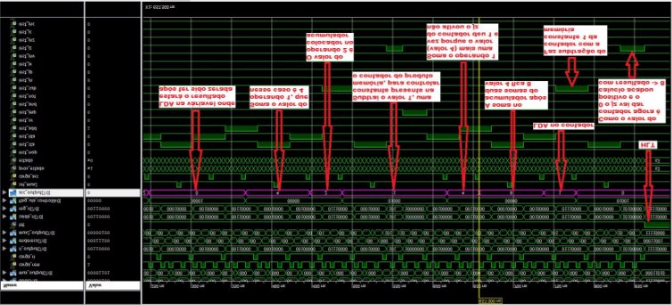

Com Atraso: 

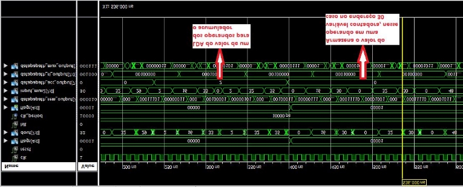

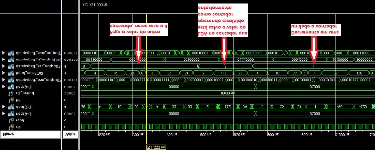

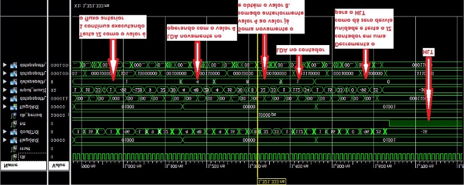

Opera ªo de SHL e Decrementador com desvio (JZ) e (JMP):

NOP 

NOP 

NOP 

LDA 24 (LDA no endere o 24 que contØm o valor 10) 

SHL (SHL em complemento de 2 gera uma multiplica ªo por 2) 

STA 25 (salva no endere o 25 a resposta do SHL) 

Desvia\_1: LDA 24 (DÆ LDA no endere o 24  → 10) 

SUB 26 (Decrementa em uma unidade esse valor porque no endere o 26 hÆ  → 1) STA 24 (salva no endere o 24 o resultado do decremento) 

LDA 24 (dÆ LDA nesse valor salvo) 

JZ 20 (Se o valor Ø zero vai para o endere o 20)  → addr\_20 

JMP 8 (senªo vai para o endere o de reinicio do fluxo)  → (Desvia\_1) 

Addr\_20: STA 24  

NOP 

HLT 

10 (addr 24) 

0 

1 (constante subtratora) 

Assembly do arquivo .coe : 

MEMORY\_INITIALIZATION\_RADIX= 10; MEMORY\_INITIALIZATION\_VECTOR= 0, 0, 0, 32, 24, 225, 16, 25, 32, 24, 112, 26, 16, 24, 32, 24, 160, 20, 128, 8, 16, 24, 0, 240, 10, 0, 1; 

Sem Atraso: 

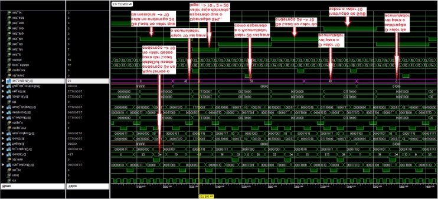

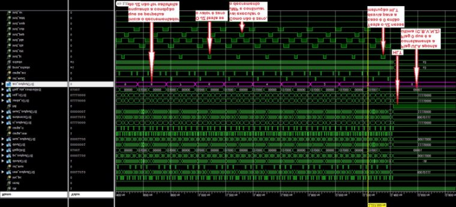

Com Atraso: 

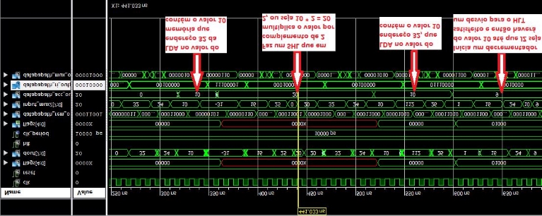

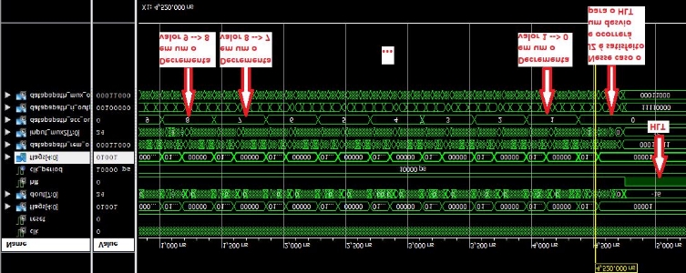

Dados de Ærea, tempo de execu ªo em ciclos de rel gio e tempo em segundos deve ser apresentado dado um determinado clock usado: 

|Programa |Nœmero de Instru ıes Executadas |
Tempo de execu ªo em 

# de ciclos de rel gio (c.c.) 
|Tempo de execu ªo em Segundos (Neander operando a 50 MHz) |
| - | :-: | - | :-: |
|Multiplica ªo por somas sucessivas |19 |148 |1480 ns |
|Programa com SUB e SHL |64 |454 |4540 ns |

